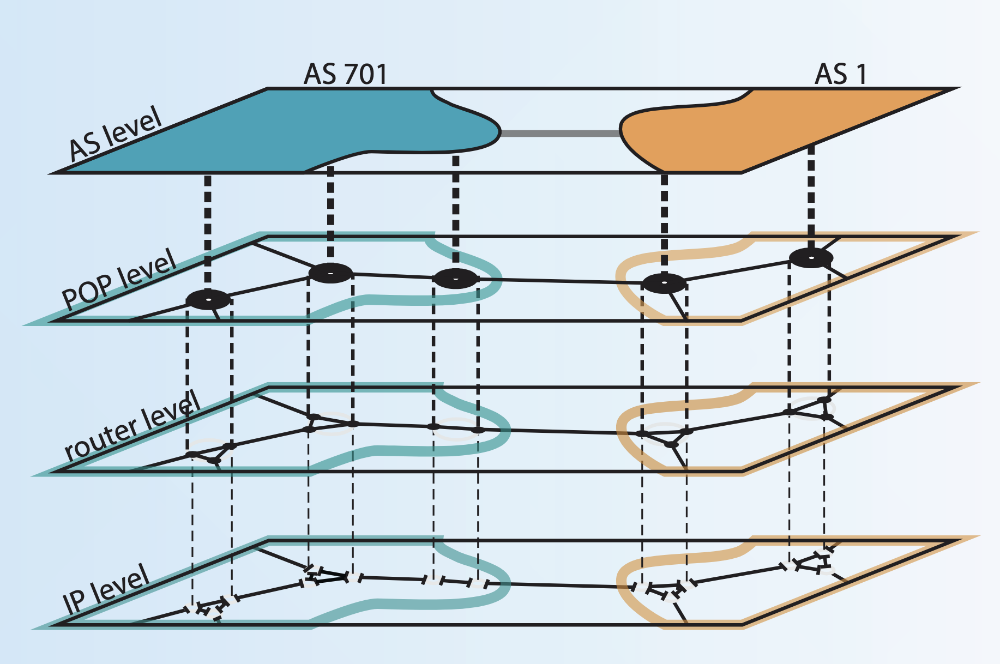
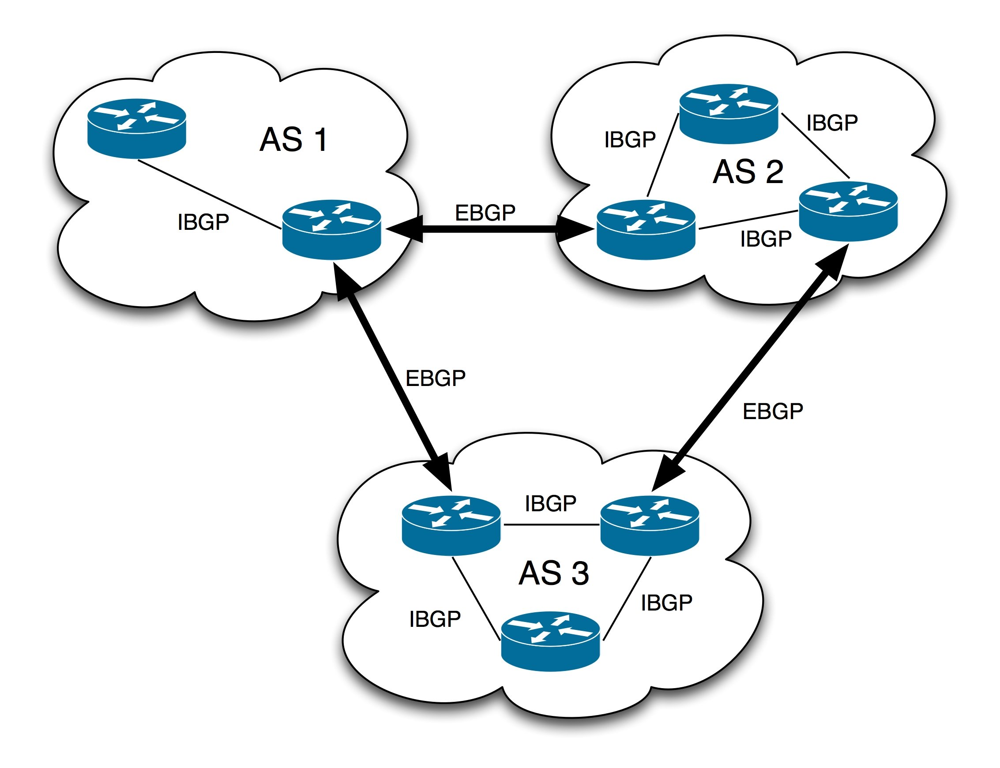

# Autonomous Systems

Reflects the structure of the internet.
The internet is a network, of computer networks
(eg Google, TU, Telekom, Vodafone, 1&1).

All the routing and configuration within one Autonomous System is a
responsibility of a single company or organisation.

First routing is done within Autonomous System, then routing across Autonomous Systems

## Autonomous System Numbers

Each Autonomous System is assigned an Autonomous System Number (ASN)
and associated a block of IP addresses.

Autonomous system numbers are 32-bit identifiers (16-bit until 2007)
and includes a blocks for public, documentation and private use.

ASNs are assigned by IANA to Regional Internet Registries (RIR),
and then distributed to entities within its designated area.

IP blocks and ASN allocations:

- **IANA** → gives large blocks to RIRs (e.g., ARIN, RIPE, APNIC).
- **RIRs** → allocate to ISPs or large enterprises.
- **ISPs** → delegate to customers.
- **Customers** → subnet internally

This hierarchy ensures global uniqueness of addresses and ASNs.
As of 2025, there are roughly 120,000 registered ASNs.

<https://www.caida.org/projects/as-core/2017/>
<https://bgp.he.net/country/DE>
<https://bgp.tools/as/3209>
<https://map.bgp.tools/>
<https://github.com/TheNetworker/visualize_bgp_asns>
