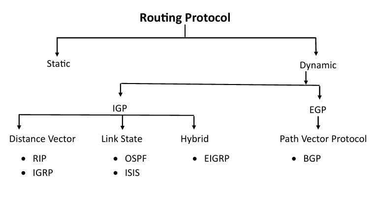
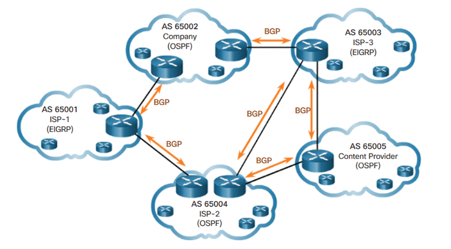

# Dynamic routing protocols - IGP vs EGP

There are two types of dynamic routing protocols

## Interior Gateway Protocols

IGPs are used to exchange routing information between routers
within a single autonomous system (like OSPR ,RIP or EIGRP).
They provide reachability to all internal subnets and loopbacks within the organization.

## Exterior Gateway Protocols

EGPs, are used to exchange routing information between autonomous systems.

There was an Exterior Gateway Protocol called,
Exterior Gateway Protocol that is now obsolete.
BGP is serving as the de facto standard EGP of the internet.

