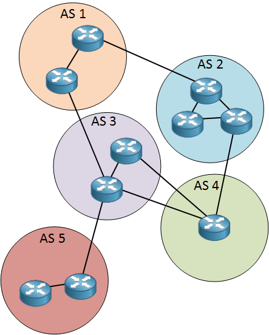
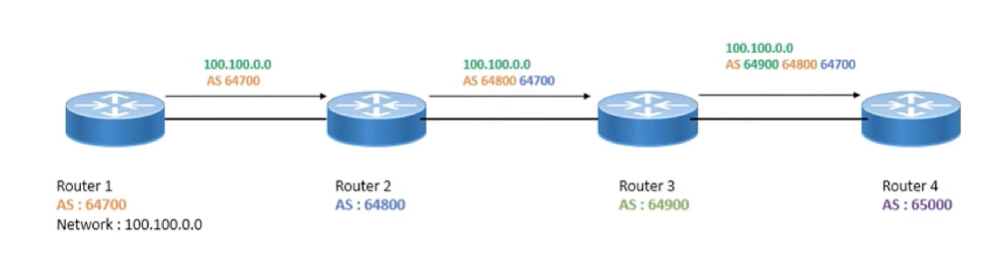

# Border Gateway Protocol

## Introduction

BGP an inter-domain routing path vector protocol.
Considered the backbone of the internet,
it is used mainly by Internet Service Providers and large corporations.

It was first described in 1989 in RFC 1105, and has been in use since 1994.
Famously sketched on the back of some napkins, hence often referenced to as the
“Two Napkin Protocol”.

## Core concepts

1. **Purpose**
    - Used to exchange routing information between Autonomous Systems.
    - Ensures global connectivity while allowing independent policies.
2. **Path Vector Protocol**
    - Unlike OSPF/EIGRP (link-state/distance-vector),
    BGP advertises paths (**AS_PATH** attribute).
    - Prevents routing loops by rejecting routes that contain the local AS.
3. **Scaling and Stability**
    - Internet has ~1M IPv4 routes
    - BGP convergence is slow compared to IGPs
4. **Transport**
    - Runs on top of TCP (port **179**) for reliable updates.
    - Uses a finite state machine (Idle → Connect → OpenSent → Established).
    - Triggered updates only (will not discover neighbours automatically)

## Policy based routing

BGP is more about policy than shortest paths.

Each path has attributes (like link weights, tags etc) that are manually configured.

Operators apply filtering, prefix-lists, route-maps to control:

- Which routes are accepted/advertised.
- Traffic engineering (inbound/outbound).
- Security (prevent route leaks, hijacks).

## Path vector

Paths are defined as Autonomous System hops, not router hops.
As each AS can have hundreds of routers.

When advertising and sharing routes, each router will
append it's own ASN to the path before passing it on.

