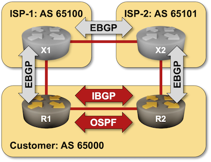
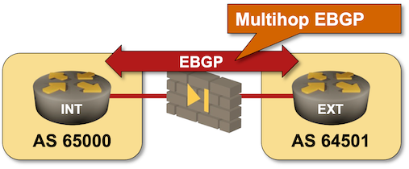
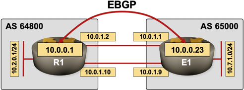
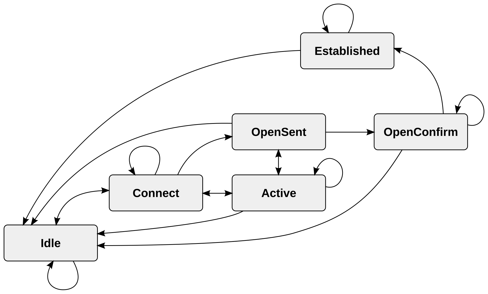

# BGP Peers

BGP Neighbours are also known as Peers, and can be used inter changeably.
Will not discover it's neighbours automatically.
They need to be manually specified.

## Peer types

- **eBGP** (External BGP) - session between routers in two different ASNs
  - direct (within same L3 network)
  - indirect (multiple hops away)
- **iBGP** (Internal BGP) - session between routers in the same ASN



There are differences in how eBGP peers and iBGP peers operate

iBGP peers advertise eBGP-learned prefixes to its iBGP neighbours.
iBGP peers advertise iBGP-learned prefixes to its eBGP neighbours.
iBGP peers does not advertise iBGP-learned prefixes to its iBGP neighbors.

### Not to be confused between IGP and iBGP

IGP routes traffic to internal destinations, while iBGP carries external
routing information within that AS, to be used by border routers for external connections.

### Multi-hop eBGP

eBGP peers don't need to be directly connected. BGP establishes TCP sessions
and exchange prefixes across paths containing devices not
running BGP (like firewalls, small switches etc).



```sh
neighbor <IP> ebgp-multihop 2
```

### Multi-link eBGP

A Load balancing (multi-link) eBGP session can be established.
Loopback interfaces are used to keep the BGP session
up in case one of the links goes down.



## Peer States

In order to make decisions in its operations,
BGP uses a simple finite state machine (FSM)
that consists of six states:

- `IDLE` - start initialising event triggers, incoming connections are rejected.
- `CONNECT` - start TCP session with peer
- `ACTIVE` - if connect failed, repeat  connection attempt, or return to `IDLE`
- `OPEN_SENT` - Session established, sent `OPEN` message, and wait's for reply
- `OPEN_CONFIRM` - Received reply `OPEN` back, wait's for `KEEPALIVE`
- `ESTABLISHED` - Received `KEEPALIVE` or `UPDATE` messages.



```sh
show ip bgp neighbors 
show ip bgp neighbors <IP> 
```
