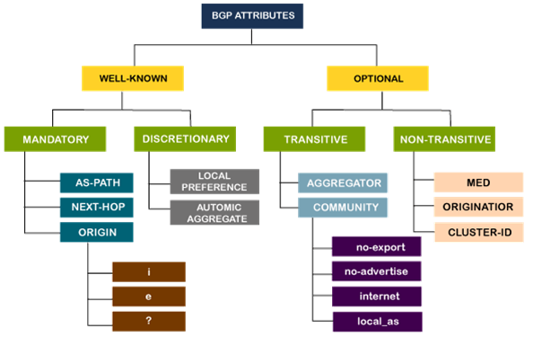
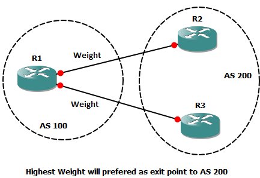
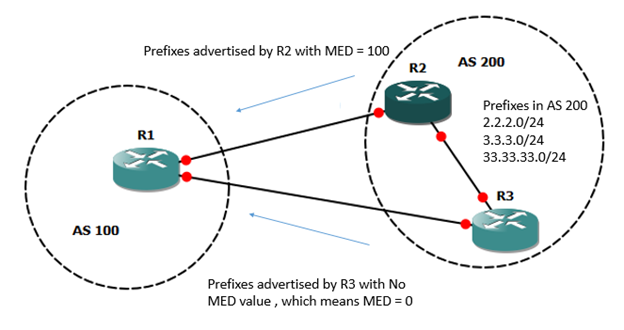

# BGP Route finding

## Policy based routing

Routers receiving route advertisement use **policy** to
accept/reject a path (eg never route through AS X or country Y).

Routers use **policy** to decide whether to advertise a path to
neighbouring AS (route traffic forwarded from company Z to destination X?)

## Attributes

IGPs like EIGRP, OSPF or RIP will choose the best path
based on metrics (shortest path, best bandwidth etc).

BGP has different ways of route selection based on various
attributes of each path.
These attributes can be manipulated to control the path that is selected.



The attributes are classified into the following types:

- WELL-KNOWN - should be recognised by every BGP router
  - MANDATORY - should be present in every `UPDATE` message and passed to other routers
  - DISCRETIONARY - is optional but passed on to other neighbour routers
- OPTIONAL - not necessary to be recognised by every BGP router
  - TRANSITIVE - is passed on to other neighbours
  - NON-TRANSITIVE - are not passed on to neighbours

Attributes are attached to `UPDATE` messages:

- Path prefix is the destination address being advertised.
  - AS-PATH: entire list of AS through which advertisement has passed.
  - NEXT-HOP: specific internal-AS router to next-hop AS
  - ORIGIN: IGP (i) or EGP (e) or incomplete (?)

## Path Selection

Best path selection is done based on the following attributes
(by order of importance):

1. Weight (CISCO only)
2. Local Preference
3. Locally Injected Routes (Self-Originated)
4. AS path
5. Origin code
6. MED
7. eBGP network over iBGP
8. IGP cost to next-hop
9. eBGP peering
10. lowest router ID
11. Minimum cluster list length
12. lowest Neighbor IP

### 1. Weight

Weight is CISCO proprietary 16-bit integer and
valid locally only (not advertised).

Highest value is preferred.



```sh
neighbor <IP> weight <WEIGHT>
```

### 2. Local Preference

32-bit integer, exchanged between iBGP peers
used decide which exit point will be preferred.

Highest value is preferred.

```sh
bgp default local-preference 110
```

### 3. Locally Injected Routes

Path originated locally via `network` command, static or directly connected route

### 4. AS_PATH

Prefer shortest AS path to a destination

### 5. Origin

Prefer IGP (`i`) over EGP (`e`), over Incomplete (`?`)

### Multi Exit Discriminator

Exchanged between eBGP Peers to tell the external neighbour
the suggested exit point to come to our AS.

MED is propagated to all neighbours,
but not passed along (Optional non transitive attribute).

32-bit integer, Lowest MED value is Preferred


